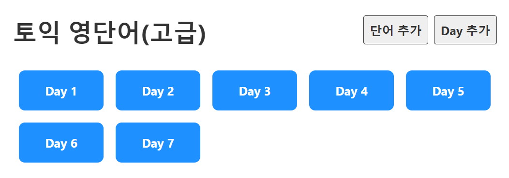
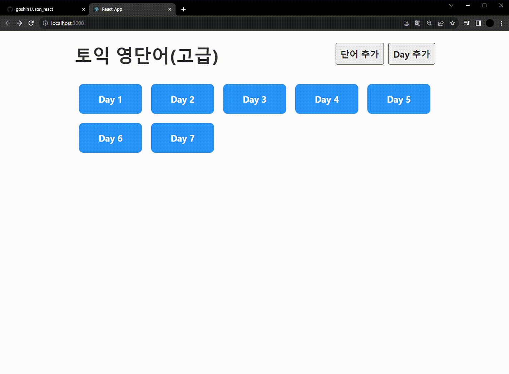
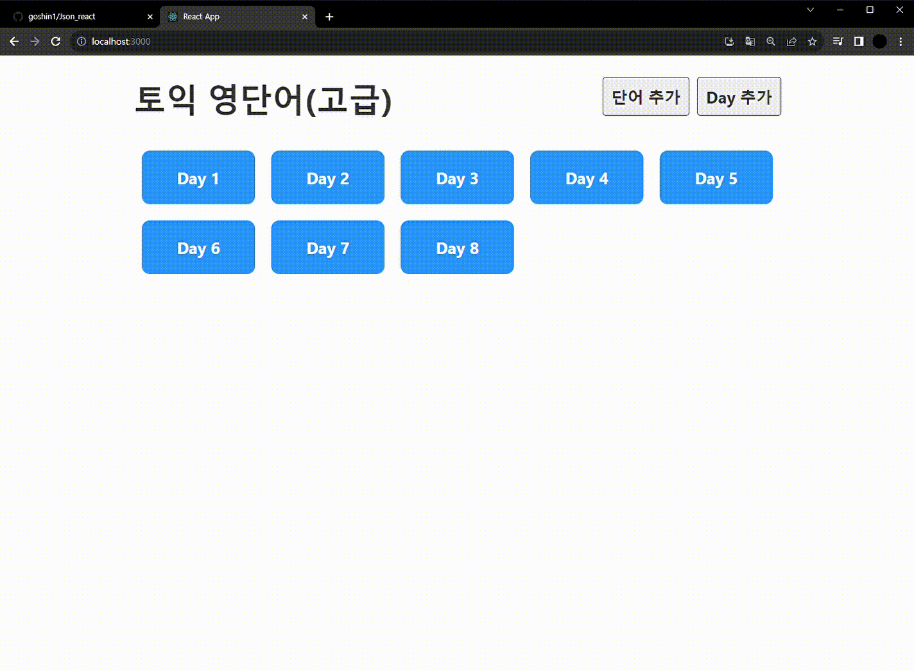
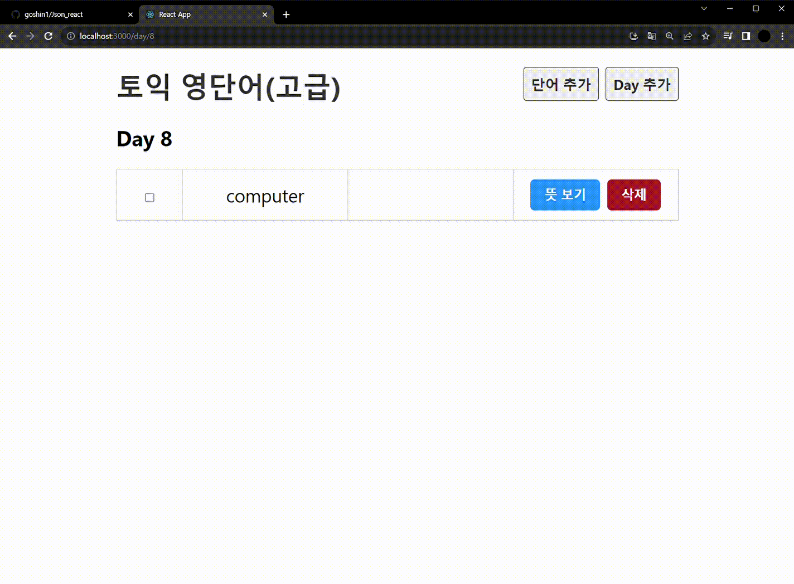
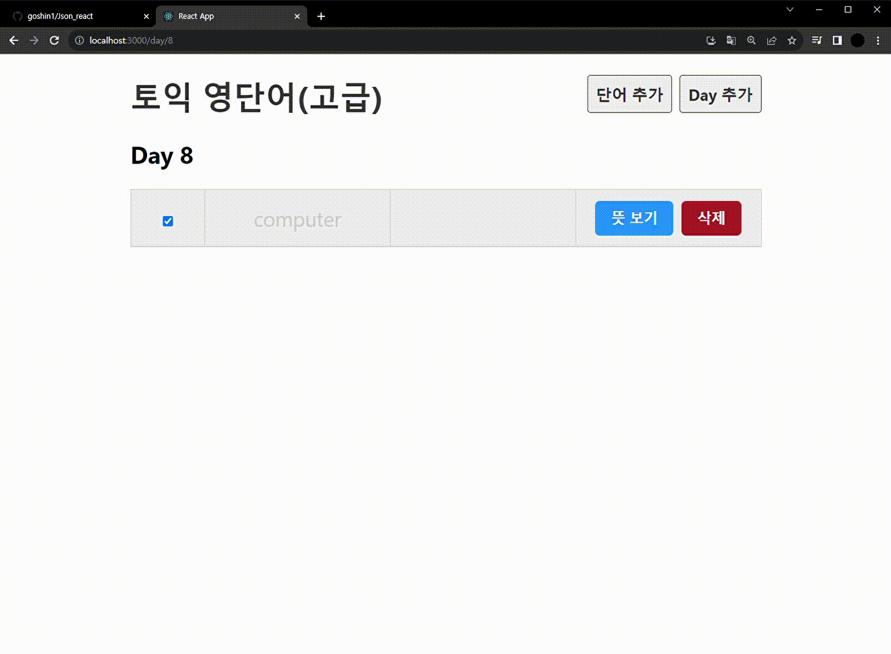

## 일일 영어 단어장
### 프로젝트 개요
> 개발 스택 : React  
> 개발 기간 : 2023.01.20 ~ 2023.01.23  
> 개발 목표 : React와 json server를 연계하여 json 파일에 단어를 저장 및 삭제, 불러오기  
> 주요 기능 : 일별로 영어 단어를 저장 및 삭제할 수 있는 영어 단어장  

### 화면 별 기능
#### 메인 화면
  

#### 날짜 추가

day 추가버튼을 누르면 날짜를 추가할 수 있습니다.   

#### 단어 추가

단어추가버튼을 누르면 추가 페이지로 이동합니다. 여기서 날짜를 선택하고 단어, 뜻을 입력 및 추가를 합니다. 이후 해당 날짜로 이동하면 추가된 단어를 확인 할 수 있습니다.   

#### 단어 확인

날짜로 이동하면 저장한 단어들을 볼 수 있습니다. 각 단어는 뜻을 숨기거나 볼 수 있으며, 외운 단어는 비활성화 할 수 있습니다.   

#### 단어 삭제

잘 못 적은 단어는 우측 버튼을 통해 삭제 할 수 있습니다.   
